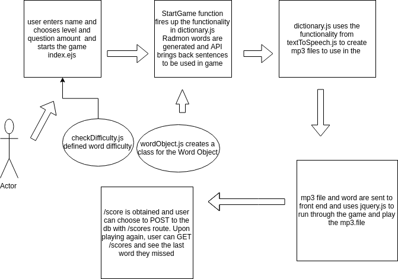

 Spelling Bee Text-to-Speech
==============================================

## LadyBees

### Author: H'Liana, Lorin, Nikki, Xochil

### Links and Resources
* [repo](https://github.com/ladybees/spellingBee/blob/master/README.md)
* [travis](https://travis-ci.com/ladybees/spellingBee)
* [Heroku](https://ladybees.herokuapp.com/)
* [Dev-Azure](https://dev.azure.com/liananiehrah/Lady%20Bees)

### Environment Setup
#### .env
- `PORT` 3000
- `MONGODB_URI` mongodb://localhost/db
- `GOOGLE_API_KEY` Google Cloud Text-to-Speech API Key 
- `WORDNIK_API_KEY` Wordnik API Key for word length/difficulty
- `INTERMEDIATE_API_KEY` Merriam Webster Dictionary Intermediate API Key
- `TWINWORDS_HOST` Generates the random word(s)
- `TWINWORDS_KEY` Key to generate random word(s)
- `GOOGLE_PRIVATE_KEY` Need for Google text-to-speech
- `GOOGLE_PRIVATE_KEY_ID` Need for Google text-to-speech
- `GOOGLE_CLIENT_EMAIL` Need for Google text-to-speech
- `GOOGLE_CLIENT_ID` Need fo Google text-to-speech

### Modules
- *`index.js`*: starts up our MongoDB (dbOn) and our server
- *`app.js`*: contains our server
- *`index.ejs`*: contains the template for the user to start the game, put their name in, choose difficulty level and choose the set amount of words they want to be tested on (5, 10, 15)
- *`game.ejs`*: contains the template for the game play page where the user can hear the word spoken, used in a sentence and try to spell the word
- *`score.ejs`*: allows you to POST you score
- *`scores.ejs`*: allows you to GET your old scores
- *`routes.js`*: contains our routes to GET and POST our routes
- *`wordObject.js`*: contains the Word constructor for the random word as well as a method to replace the current spelling word with a blank line
- *`speechtext.js`*: contains the functionality to turn the text into speech
- *`dictionary.js`*: contains the functionality for the API to use the generated random word to GET a sentence, and then uses the `speechtext.js` function to turn the text into speech
- *`score-schema.js`*: contains our Mongoose schema for the score page
- *`score-model.js`*: defines the GET and POST routes for the scores/schema
- *`checkDifficulty.js`*: contains the functionality to allow the user to choose difficulty level for game
#### 
##### Exported Values and Methods
###### `startGame(request, response)`: starts game

###### `class WordObject(word, sentence, audioFilePathWord, audioFilePathSentence` : word constructor for our random word

###### `speechToText = (textToSynthesize, id)`: writes an MP3 audio file based on the word

###### `class Score` : creates the GET and POST methods on the Score object

###### `mongoose.model(score)` : exports the Mongoose Score schema

###### `getFinalWords` : creates the functionality to allow word difficulty levels for the user

#### Tests
* To run tests, please use the `npm run test` command.
* Tests cover the following:
  ##### Routes
  * `GET /` should return 200 status
  * `GET /scores` should return 200 status
  * `POST /game` should return 200 status
  * `POST /score` should return 200 status
  
  ##### Modules / Functionality
  * `Dictionary.js` should return `X` number of word objects based on user input
  * `wordObject.js` can create a new word object and replace sentences with blank lines
  * `checkDifficulty.js` returns only objects with the user's difficulty
  
  ##### MongoDB
  * Tests `POST`
  * Tests `GET`

#### UML

